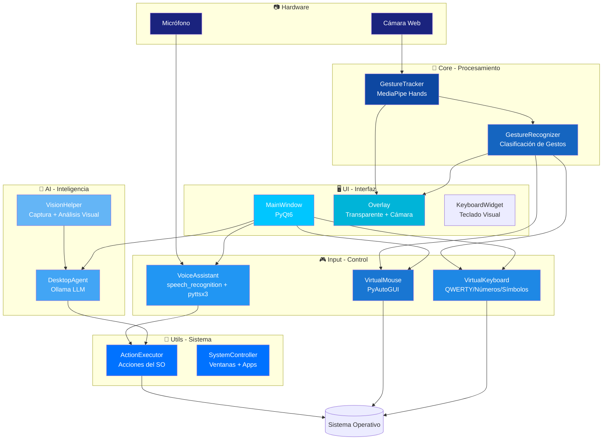

<div align="center">
  
</div>

<p align="center">
  <a href="https://git.io/typing-svg">
    
  </a>
</p>

<p align="center">
  
  
  
  
  
  
  
</p>

> **🏷️ Nombre interno del sistema:** `GestureOS` — Así aparece en logs, código y ventanas.

---

## 📋 Tabla de Contenidos

- [Visión General](#-visión-general)
- [Arquitectura](#-arquitectura)
- [Características](#-características)
- [Sistema de Gestos](#-sistema-de-gestos)
- [Comandos de Voz](#-comandos-de-voz)
- [Stack Tecnológico](#-stack-tecnológico)
- [Estructura del Proyecto](#-estructura-del-proyecto)
- [Instalación](#-instalación)
- [Uso](#-uso)
- [Configuración](#-configuración)
- [Solución de Problemas](#-solución-de-problemas)
- [Licencia](#-licencia)

---

## 🌐 Visión General

**Motion Control** (nombre interno: **GestureOS**) es un sistema de control de escritorio que te permite manejar tu ordenador **sin tocarlo**, usando solo gestos de mano capturados por cámara web, comandos de voz en español, y un agente de inteligencia artificial local.

### ¿Qué puedes hacer con Motion Control?

| Capacidad | Descripción |
|-----------|-------------|
| 🖐️ **Mouse Virtual** | Mueve el cursor, haz clic, arrastra y scrollea con gestos de mano |
| ⌨️ **Teclado Virtual** | Escribe señalando teclas con la mano, activable por gesto |
| 🎤 **Asistente de Voz** | Controla tu PC con comandos de voz en español |
| 🤖 **Agente IA Local** | Consulta una LLM local (Ollama) que puede ver tu pantalla y ejecutar acciones |
| 🔍 **Visión por IA** | Analiza tu pantalla con modelos de visión local |
| 🎯 **Zoom por gestos** | Acerca/aleja con las dos manos (Ctrl+scroll) |

---

## 🏗 Arquitectura



---

## ✨ Características

### 🖐️ Control por Gestos
- Detección de hasta **2 manos** en tiempo real con MediaPipe
- **Mano izquierda**: control del cursor (movimiento, arrastre, scroll)
- **Mano derecha**: acciones (clic, clic derecho, selección, scroll)
- **Gestos combinados**: zoom con dos manos, toggle de teclado
- **Dwell click**: mantén la mano quieta 1.5s para hacer clic automático
- **Sliders de velocidad**: ajusta la sensibilidad en tiempo real

### 🎤 Asistente de Voz (Español)
- Reconocimiento de voz con **Google Speech Recognition** y **Whisper**
- Más de **40 comandos** predefinidos en español
- Sistemas de ventanas: abrir/cerrar/minimizar/maximizar
- Atajos de teclado: copiar, pegar, deshacer, guardar...
- Control de volumen, scroll, zoom
- apertura de aplicaciones: navegador, editor, terminal...
- Síntesis de voz con **pyttsx3**

### 🤖 Agente IA Local
- Integración con **Ollama** (modelos LLM locales)
- **Análisis de pantalla** con modelos de visión
- Ejecución de acciones a partir de lenguaje natural
- Conversación con memoria contextual
- Compatible con cualquier modelo de Ollama (llama3, mistral, qwen...)

### ⌨️ Teclado Virtual Inteligente
- 4 modos: **alfabético**, **numérico**, **símbolos**, **navegación**
- Activación por gesto (👍👍)
- Escritura por pinch o clic sobre teclas
- Teclas especiales: Shift, Espacio, Enter, Borrar

### 🖥️ Overlay Transparente
- Feed de cámara en vivo
- Indicadores de gesto con iconos y colores
- Estado de módulos (Mouse/Teclado: ON/OFF)
- Barra de progreso de dwell click
- Modos activos: ZOOM, DRAG, SCROLL, DWELL, SELECT
- FPS en tiempo real
- Log de eventos recientes

---

## 🎮 Sistema de Gestos

### Mano Izquierda — Movimiento del Cursor

| Gesto | Icono | Acción |
|-------|-------|--------|
| Palma abierta | 🖐️ | Mover el cursor |
| Pinch (índice + pulgar) | 🤏 | Arrastrar (drag) |
| Dos dedos extendidos | ✌️ | Scroll natural (trackpad) |
| Mano quieta 1.5s | 🖐️⏳ | Dwell click automático |
| Pulgar arriba | 👍 | Mover cursor (alternativo) |

### Mano Derecha — Acciones

| Gesto | Icono | Acción |
|-------|-------|--------|
| Puño | ✊ | Click izquierdo |
| Pulgar arriba | 👍 | Click izquierdo |
| Pulgar abajo | 👎 | Click derecho |
| Índice + medio (Peace) + mover | ✌️ | Seleccionar texto (drag) |
| Un dedo arriba | ☝️ | Scroll clásico |
| Wink de índice | 🤌 | Click suave |

### Ambas Manos

| Combinación | Acción |
|-------------|--------|
| 👍👍 (ambos pulgares arriba) | Activar/Desactivar teclado virtual |
| 🖐️🖐️ (ambas palmas abiertas) | Zoom in/out (Ctrl + scroll) |

### Atajos de Teclado por Gesto (Mano Derecha)

| Secuencia | Acción |
|-----------|--------|
| ✊ → ✊ (doble puño rápido) | Ctrl+C (copiar) |
| 👎 → 👎 (doble pulgar abajo rápido) | Ctrl+Z (deshacer) |
| 👎 → 👍 (pulgar abajo → arriba rápido) | Ctrl+V (pegar) |

---

## 🎤 Comandos de Voz

El asistente de voz reconoce comandos en español. Algunos ejemplos:

### Gestión de Ventanas
| Comando | Acción |
|---------|--------|
| "Abrir navegador" | Abre el navegador web |
| "Abrir Chrome" | Abre Google Chrome |
| "Cerrar ventana" | Cierra la pestaña/ventana activa |
| "Minimizar ventana" | Minimiza la ventana activa |
| "Siguiente ventana" | Alt+Tab |

### Atajos de Teclado
| Comando | Acción |
|---------|--------|
| "Copiar" / "Ctrl C" | Ctrl+C |
| "Pegar" / "Ctrl V" | Ctrl+V |
| "Deshacer" / "Ctrl Z" | Ctrl+Z |
| "Guardar" / "Ctrl S" | Ctrl+S |
| "Buscar" / "Ctrl F" | Ctrl+F |

### Sistema
| Comando | Acción |
|---------|--------|
| "Subir volumen" | Aumenta volumen |
| "Bajar volumen" | Reduce volumen |
| "Silenciar" | Mute |
| "Captura de pantalla" | Screenshot |
| "Scroll arriba/abajo" | Scroll |
| "Zoom in/out" | Zoom |

### IA
| Comando | Acción |
|---------|--------|
| "Agente, ¿qué hora es?" | Consulta al agente IA |
| "Analiza la pantalla" | Describe la pantalla con visión IA |
| "Escribe hola mundo" | Escribe texto automáticamente |

> Cualquier frase que no coincida con un comando se envía automáticamente al agente IA.

---

## 🛠 Stack Tecnológico

### Dependencias Principales

| Librería | Versión | Propósito |
|----------|---------|-----------|
| `opencv-python` | ≥4.8.0 | Captura y procesamiento de video |
| `mediapipe` | ≥0.10.9 | Detección de landmarks de mano |
| `PyQt6` | ≥6.6.0 | Interfaz gráfica (ventana + overlay) |
| `pyautogui` | ≥0.9.54 | Control de mouse y teclado del SO |
| `speechrecognition` | ≥3.10.0 | Reconocimiento de voz |
| `pyttsx3` | ≥2.90 | Síntesis de voz (TTS) |
| `ollama` | ≥0.1.0 | Cliente para LLM local |
| `pynput` | ≥1.7.6 | Control de entrada del sistema |
| `Pillow` | ≥10.1.0 | Procesamiento de imágenes |
| `mss` | ≥9.0.1 | Captura de pantalla rápida |
| `psutil` | ≥5.9.6 | Información del sistema |
| `numpy` | ≥1.24.0 | Cálculos numéricos |
| `pyaudio` | ≥0.2.14 | Entrada de audio |
| `python-pptx` | ≥0.6.23 | Exportación a PowerPoint |

### Dependencias del Sistema (Linux)

```bash
# PyAudio
sudo apt install portaudio19-dev

# PyQt6 / xcb
sudo apt install libxcb-cursor0

# OpenCV
sudo apt install libopencv-dev
```

### Windows

En Windows solo necesitas Python 3.10+ y las dependencias pip. PyAutoGUI funciona nativamente.

---

## 📁 Estructura del Proyecto

```
Motion-Control/
├── main.py                          # Punto de entrada principal (clase GestureOS)
├── hand_landmarker.task             # Modelo pre-entrenado de MediaPipe Hands
├── requirements.txt                 # Dependencias pip
├── LICENSE                          # Licencia MIT
├── docs/
│   └── MOUSE.md                     # Documentación de gestos del mouse
├── src/
│   ├── __init__.py
│   ├── core/
│   │   ├── config.py                # Configuración centralizada
│   │   ├── gesture_tracker.py       # Tracker de landmarks con MediaPipe
│   │   └── gesture_recognizer.py    # Clasificador de gestos
│   ├── input/
│   │   ├── virtual_mouse.py         # Control del cursor por gestos
│   │   ├── virtual_keyboard.py      # Teclado virtual multidisposición
│   │   └── voice_assistant.py       # Asistente de voz en español
│   ├── ai/
│   │   ├── desktop_agent.py         # Agente LLM local (Ollama)
│   │   └── vision_helper.py         # Captura y análisis de pantalla
│   ├── ui/
│   │   ├── main_window.py           # Ventana principal de control
│   │   ├── overlay.py               # Overlay transparente con cámara
│   │   └── virtual_keyboard_widget.py  # Widget del teclado visual
│   └── utils/
│       ├── action_executor.py       # Ejecutor centralizado de acciones
│       └── system_control.py        # Control del sistema operativo
├── logs/                            # Logs generados automáticamente
│   └── gestureos.log
└── screenshots/                     # Capturas de pantalla
```

---

## 🚀 Instalación

### Prerrequisitos

```bash
# Python 3.10+
python --version  # Debe ser ≥ 3.10

# Ollama (para el agente IA - opcional)
curl -fsSL https://ollama.com/install.sh | sh
ollama pull llama3:8b  # o cualquier modelo compatible
```

### Instalación

```bash
# 1. Clona el repositorio
git clone https://github.com/Ruby570bocadito/Motion-Control.git
cd Motion-Control

# 2. Crea un entorno virtual
python -m venv venv
source venv/bin/activate  # Linux/Mac
# venv\Scripts\activate   # Windows

# 3. Instala dependencias
pip install -r requirements.txt

# 4. Dependencias del sistema (solo Linux)
sudo apt install portaudio19-dev libxcb-cursor0

# 5. Descarga el modelo de MediaPipe (si no está incluido)
# El archivo hand_landmarker.task debe estar en la raíz del proyecto
```

---

## 🎯 Uso

### Inicio Rápido

```bash
# Activa el entorno virtual (si no lo está)
source venv/bin/activate

# Ejecuta Motion Control
python main.py
```

### Panel de Control

Una vez iniciado verás dos ventanas:

1. **Ventana Principal** — Panel de control con:
   - Botón **Iniciar Sistema** para arrancar la captura
   - Checkboxes para activar/desactivar módulos (Mouse, Teclado, Voz, IA)
   - Slider de velocidad del cursor
   - Log de eventos en tiempo real
   - Display del gesto detectado

2. **Overlay Transparente** — Feed de cámara con:
   - Indicadores de estado (Mouse/Teclado ON/OFF)
   - Icono del gesto actual
   - Barra de progreso de dwell click
   - Mensajes de log recientes
   - FPS

### Flujo de Trabajo Típico

```python
# También puedes usar Motion Control desde código (la clase es GestureOS)
from main import GestureOS

app = GestureOS()
app.run()
```

### Usar el Agente IA

```bash
# Asegúrate de que Ollama esté corriendo
ollama serve

# En Motion Control, activa el Agente IA desde el panel
# Luego habla: "Agente, abre el navegador y busca Python"
```

---

## ⚛️ Configuración

Toda la configuración está centralizada en `src/core/config.py`:

### Mouse

```python
MOUSE_SMOOTHING = 0.30          # Suavizado del movimiento (0-1)
MOUSE_SPEED_MULTIPLIER = 2.2    # Velocidad base del cursor
MOUSE_DEADZONE = 8               # Zona muerta en píxeles
CLICK_COOLDOWN = 0.45            # Cooldown entre clics (segundos)
DWELL_THRESHOLD = 1.5            # Segundos para dwell click
SCROLL_COOLDOWN = 0.08           # Cooldown entre scrolls
```

### Voz

```python
VOICE_LANGUAGE = "es"                          # Idioma
VOICE_ENERGY_THRESHOLD = 300                   # Sensibilidad del micrófono
VOICE_COMMAND_COOLDOWN = 2.0                   # Cooldown entre comandos
VOICE_LISTEN_TIMEOUT = 4                       # Timeout de escucha (segundos)
VOICE_PHRASE_TIME_LIMIT = 6                    # Límite de frase (segundos)
```

### IA / Ollama

```python
OLLAMA_MODEL = "llama3:8b"                     # Modelo LLM
OLLAMA_VISION_MODEL = "llama3:8b"              # Modelo de visión
OLLAMA_BASE_URL = "http://localhost:11434"     # URL de Ollama
OLLAMA_TEMPERATURE = 0.3                       # Temperatura del modelo
```

### Cámara

```python
CAPTURE_FRAME_WIDTH = 640                      # Resolución de captura
CAPTURE_FRAME_HEIGHT = 480
CAPTURE_FPS = 30                               # FPS de captura
OVERLAY_FPS = 30                               # FPS del overlay
MEDIAPIPE_DETECTION_CONFIDENCE = 0.8           # Confianza de detección
MEDIAPIPE_TRACKING_CONFIDENCE = 0.7            # Confianza de tracking
```

> También puedes ajustar la velocidad del cursor **en tiempo real** con el slider del panel de control (1=lento, 5=rápido).

---

## ❓ Solución de Problemas

| Problema | Solución |
|----------|----------|
| **Error: "No se pudo abrir la cámara"** | Verifica que la cámara no esté ocupada por otra app |
| **MediaPipe no detecta la mano** | Asegura buena iluminación, fondo sin distracciones |
| **Error de PyAudio** | `sudo apt install portaudio19-dev` (Linux) |
| **Error de Qt xcb** | `sudo apt install libxcb-cursor0` (Linux) |
| **El cursor solo se mueve en una dirección** | Verifica que la cámara capture toda tu mano |
| **PyAutoGUI lanza error en Linux** | Instala `sudo apt install python3-xlib` o `scrot` |
| **Ollama no responde** | Ejecuta `ollama serve` y verifica `ollama list` |
| **No se escucha el micrófono** | Verifica que el micrófono esté configurado como predeterminado |

### Seguridad

- **PyAutoGUI FAILSAFE** está habilitado: mueve el cursor a la **esquina superior izquierda** para detener cualquier acción automática.
- Los logs se guardan en `logs/gestureos.log` para depuración.

---

## 📄 Licencia

Distribuido bajo la **Licencia MIT**. Consulta el archivo `LICENSE` para más información.

---

<p align="center">
  <b>Motion Control</b> (GestureOS) — Controla tu ordenador sin tocarlo
  <br>
  <a href="https://github.com/Ruby570bocadito/Motion-Control">GitHub</a>
  ·
  <a href="https://github.com/Ruby570bocadito/Motion-Control/issues">Reportar Error</a>
  ·
  <a href="https://github.com/Ruby570bocadito/Motion-Control/issues">Solicitar Característica</a>
</p>

<p align="center">
  
</p>
