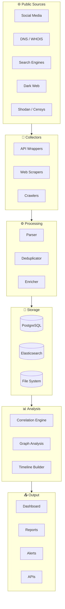

<div align="center">
  
</div>

<p align="center">
  <a href="https://git.io/typing-svg">
    
  </a>
</p>

<p align="center">
  
  
  
  
  
  
</p>

<p align="center">
  <b>Formerly known as</b> <code>OSINT-EYE</code> &nbsp;|&nbsp; <b>Now rebranded to</b> <code>Horizon-Intel</code>
</p>

---

## 📋 Table of Contents

- [Overview](#-overview)
- [Architecture](#-architecture)
- [Features](#-features)
- [Supported Data Sources](#-supported-data-sources)
- [Quick Start](#-quick-start)
- [Usage Examples](#-usage-examples)
- [Configuration](#-configuration)
- [Roadmap](#-roadmap)
- [Contributing](#-contributing)
- [License](#-license)

---

## 🌐 Overview

**Horizon-Intel** is an enterprise-grade **Open-Source Intelligence (OSINT)** platform designed for automated data collection, correlation, and analysis from publicly available sources. Built with Python and modern data visualization technologies, it empowers security professionals, threat analysts, and researchers to gather actionable intelligence efficiently.

### Why Horizon-Intel?

| Capability | Description |
|------------|-------------|
| 🔍 **Automated Collection** | Multi-threaded collectors for 20+ public sources |
| 🧠 **Correlation Engine** | Cross-references data points to uncover hidden relationships |
| 📊 **Advanced Visualization** | Interactive dashboards with real-time updates |
| 📝 **Reporting** | Auto-generates professional PDF/HTML intelligence reports |

---

## 🏗 Architecture


### Data Flow



---

## ✨ Features

### 🔬 Intelligence Collection
- Multi-source data aggregation (social media, DNS, WHOIS, search engines, dark web)
- Scheduled and on-demand collection with configurable intervals
- Proxy and Tor support for anonymous scraping
- Rate limiting and polite crawling policies

### 🧩 Correlation Engine
- Entity extraction and relationship mapping
- Cross-reference data across sources
- Automated pattern recognition and anomaly detection
- Graph-based relationship visualization

### 📈 Visualization & Reporting
- Real-time interactive dashboards (Grafana / Plotly)
- Timeline analysis and geo-mapping
- Export to PDF, HTML, CSV, JSON
- Custom report templates

### 🔒 Security & Compliance
- Encrypted storage for sensitive data
- Audit logging for all operations
- Role-based access control (RBAC)
- GDPR-compliant data handling

---

## 📡 Supported Data Sources

| Category | Source | Type | Status |
|----------|--------|------|--------|
| 🌐 **Search** | Google Dorks | Search Engine | ✅ |
| 🌐 **Search** | Bing | Search Engine | ✅ |
| 🌐 **Search** | DuckDuckGo | Search Engine | ✅ |
| 🌐 **Search** | Shodan | IoT Search | ✅ |
| 🌐 **Search** | Censys | Attack Surface | ✅ |
| 📍 **DNS** | PassiveTotal | DNS / WHOIS | ✅ |
| 📍 **DNS** | SecurityTrails | DNS History | ✅ |
| 📍 **DNS** | VirusTotal | Domain / IP | ✅ |
| 📍 **DNS** | Sublist3r | Subdomain | ✅ |
| 📍 **DNS** | Amass | Subdomain | ✅ |
| 💬 **Social** | Twitter / X | Social Media | ✅ |
| 💬 **Social** | Reddit | Social Media | ✅ |
| 💬 **Social** | Telegram | Messaging | ✅ |
| 🌑 **Dark Web** | Ahmia | Tor Search | ✅ |
| 🌑 **Dark Web** | OnionScan | Dark Web | ⏳ |
| 🔧 **Technical** | GitHub | Code Search | ✅ |
| 🔧 **Technical** | Have I Been Pwned | Breach Data | ✅ |
| 🔧 **Technical** | Dehashed | Credential Leaks | ✅ |

---

## 🚀 Quick Start

### Prerequisites

```bash
# Python 3.10+
python --version  # > 3.10.x

# PostgreSQL (optional, for production)
psql --version
```

### Installation

```bash
# Clone the repository
git clone https://github.com/Ruby570bocadito/Horizon-Intel.git
cd Horizon-Intel

# Create virtual environment
python -m venv venv
source venv/bin/activate  # On Windows: venv\Scripts\activate

# Install dependencies
pip install -r requirements.txt

# Initialize configuration
cp config.example.yml config.yml
nano config.yml  # Edit your API keys and settings

# Initialize database (optional)
python manage.py db init
```

### Run

```bash
# Start the platform
python horizon.py

# Or with Docker
docker-compose up -d
```

### Verify Installation

```bash
# Run a basic reconnaissance
python horizon.py --domain example.com --quick

# Check dashboard
open http://localhost:8080
```

---

## 💻 Usage Examples

### Domain Intelligence Gathering

```python
from horizon import HorizonIntel

client = HorizonIntel(api_key="your_key")

# Enumerate a domain
results = client.enumerate(
    domain="example.com",
    sources=["shodan", "virustotal", "securitytrails"],
    depth="full"
)

print(results.summary())
```

### CLI Quick Scan

```bash
# Quick domain reconnaissance
python horizon.py --domain example.com --sources shodan,vt --output json

# Full intelligence profile
python horizon.py --domain example.com --full --report pdf

# Monitor a domain for changes
python horizon.py --domain example.com --monitor --interval 1h
```

### API Usage

```bash
# REST API endpoint
curl -X POST http://localhost:8080/api/v1/enumerate \
  -H "Authorization: Bearer YOUR_TOKEN" \
  -H "Content-Type: application/json" \
  -d '{"domain": "example.com", "sources": ["shodan", "virustotal"]}'
```

### Generate Report

```bash
# Generate HTML report
python horizon.py --domain example.com --report html --output ./reports/

# Generate PDF report
python horizon.py --domain example.com --report pdf --output ./reports/
```

---

## ⚙️ Configuration

Horizon-Intel uses a YAML configuration file for all settings:

```yaml
# config.yml
app:
  name: "Horizon-Intel"
  version: "2.0.0"
  debug: false

collectors:
  shodan:
    api_key: "YOUR_SHODAN_KEY"
    rate_limit: 1  # requests per second
  virustotal:
    api_key: "YOUR_VT_KEY"

database:
  host: localhost
  port: 5432
  name: horizon_intel

reports:
  format: [pdf, html, json]
  template: "professional"
```

---

## 🗺 Roadmap

- [x] Core OSINT collectors (v1.0)
- [x] Correlation engine (v1.5)
- [x] Web dashboard (v2.0)
- [ ] Machine learning integration (v2.5)
- [ ] Real-time alerting system (v2.5)
- [ ] Mobile companion app (v3.0)
- [ ] Plugin marketplace (v3.0)

---

## 🤝 Contributing

Contributions are what make the open source community amazing! Any contributions you make are **greatly appreciated**.

1. Fork the Project
2. Create your Feature Branch (`git checkout -b feature/AmazingFeature`)
3. Commit your Changes (`git commit -m 'Add some AmazingFeature'`)
4. Push to the Branch (`git push origin feature/AmazingFeature`)
5. Open a Pull Request

---

## 📄 License

Distributed under the **MIT License**. See `LICENSE` for more information.

---

<p align="center">
  <b>Horizon-Intel</b> — Enterprise Open-Source Intelligence Platform
  <br>
  <a href="https://github.com/Ruby570bocadito/Horizon-Intel">GitHub</a>
  ·
  <a href="https://github.com/Ruby570bocadito/Horizon-Intel/issues">Report Bug</a>
  ·
  <a href="https://github.com/Ruby570bocadito/Horizon-Intel/issues">Request Feature</a>
</p>

<p align="center">
  
</p>
